# She Sports
by Dee - She Codes crowdfunding project - DRF Backend.

## About
The website aims to empower women between the ages of 10 and 35 by offering diverse funding opportunities for various sporting needs. From covering travel expenses to acquiring equipment, uniforms, and coaching services, it's a platform dedicated to supporting female athletes in their athletic pursuits.

## Features
* Create an account page so users can see their projects and projects that they have pledged to.
* Create a project page.
* Allow users to pledge to a project.

### Stretch Goals
* Allow users who have created a project to update a news feed so that users who have pledged can have updates to the users athletic journey.
* Allow for users to search for projects based on what sport they are for. Probably have to create categories for each project.
* Have a scale on the home page that indicates how much money has been raised so far for womens sports.

## API Specification

| HTTP Method | Url | Purpose | Request Body | Successful Response Code | Authentication   Authorization
| --- | ------- | ------ | ---- | -----| ----|
| GET | projects/ | Return all projects | N/A | 200 | N/A |
| POST | projects/ | Add new project | project object | 201 | User must be logged in. |
| POST | api-token-auth/ | Get auth token | N/A | 200 | N/A |
| GET | projects/1/ | Returns a specific project | project object | 200 | N/A |
| PUT | projects/ < project id >/ | Update a project | project object | 200 | User must be logged in |
| GET | pledges/ | Get all pledges | pledges object | 200 | N/A |
| POST | pledges/ | Add new pledge | pledges object | 201 | User must be logged in |
| PUT | pledges/ < pledge id >/ | Update a pledge | pledges object | 200 | User must be logged in |
| GET | users/ | Get all users | users app | 200 | N/A|
| POST | users/ | Create a new user | users app | 200 | N/A|
| GET | pledges/1/ | Returns a specific pledge | pledge object | 200 | N/A|
| GET | users/< user id >/ | Returns a specific user | user app | 200 | N/A|

## Database Schema
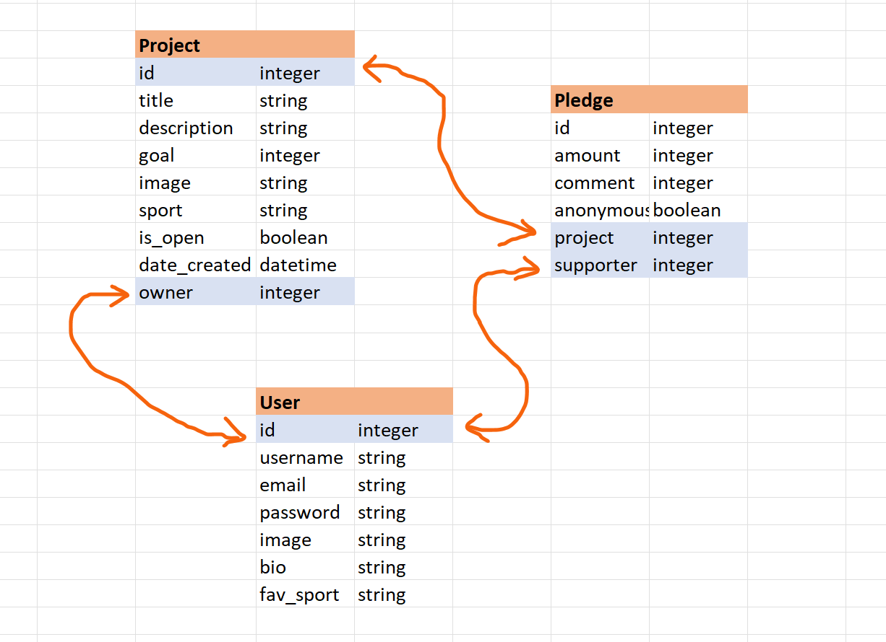

## Wireframes
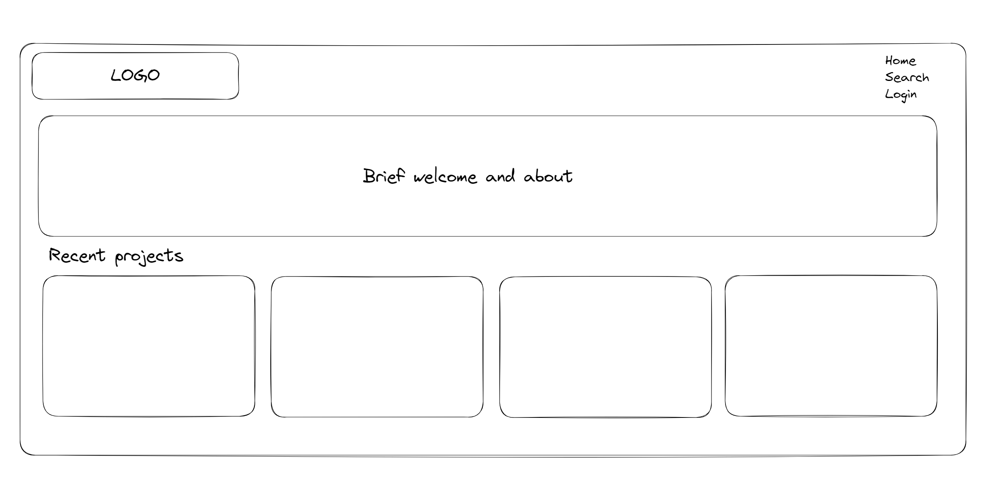

## Colour Scheme
Blue - CMYK 100/96/22/12 
Cream - CMYK 2/6/20/0

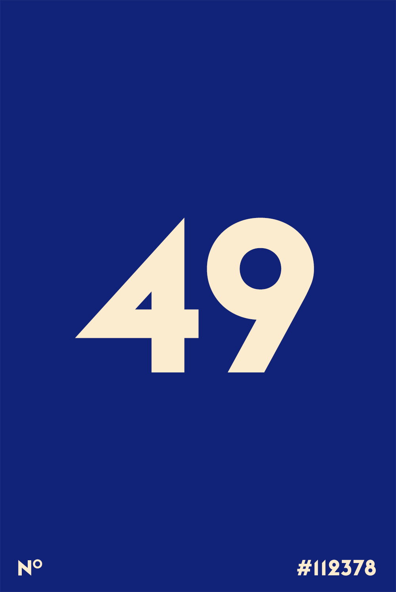

## Fonts
Heading - Lionel Classic 
Body - Helvetica

## Submission Documentation
{{ Fill this section out for submission }}

Deployed Project: [Deployed website](https://solitary-sound-6587.fly.dev/)

### How To Run
{{ What steps to take to run this code }}

### Updated Database Schema
{{ Updated schema }}

### Updated Wireframes
The wireframes is the same as the origninal draft posted earlier in this readme.  

### How To Register a New User
1. In Insomnia, create a new HTTP POST request
2. Enter the following endpoint - https://solitary-sound-6587.fly.dev/users/
3. Use the following JSON template - 

	    {"username":"Enter your username",
	    "password":"Enter your password",
	    "email":"Enter your email address",
	    "first_name": "Enter your first name",
	    "last_name": "Enter your last name"}

4. Click send. A successful request will show 200 and a new user will be created.

### How To Create a New Project
1. In Insomnia, creat e new HTTP POST request. 
2. Enter the following endpoint - https://solitary-sound-6587.fly.dev/projects/
3. Use the following JSON template. 

        {"title":"Enter project title",
         "description":"Enter project description.",
         "goal": Enter project goal,
         "image":"Enter image URL",
         "is_open":true,
         "date_created":"2020-03-20T14:28:23.382748Z",
         "owner":"Real Creator"}

4. In the auth drop down, select 'Bearer' and ensure you enter your auth token. To create an auth token, you can make a POST request to https://solitary-sound-6587.fly.dev/api-token-auth/ and enter in your username as the JSON, like so: 

	    {"username":"Enter username",
	    "password":"Enter password",
	    "email":"Enter email"}

5. Click send and a successful request will show a 201 request. 

### Screenshots
*  A screenshot of Insomnia, demonstrating a successful GET method for any endpoint.

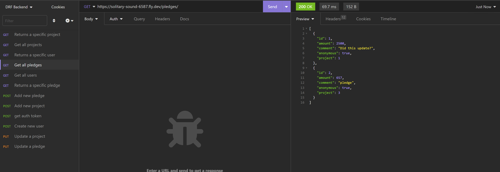
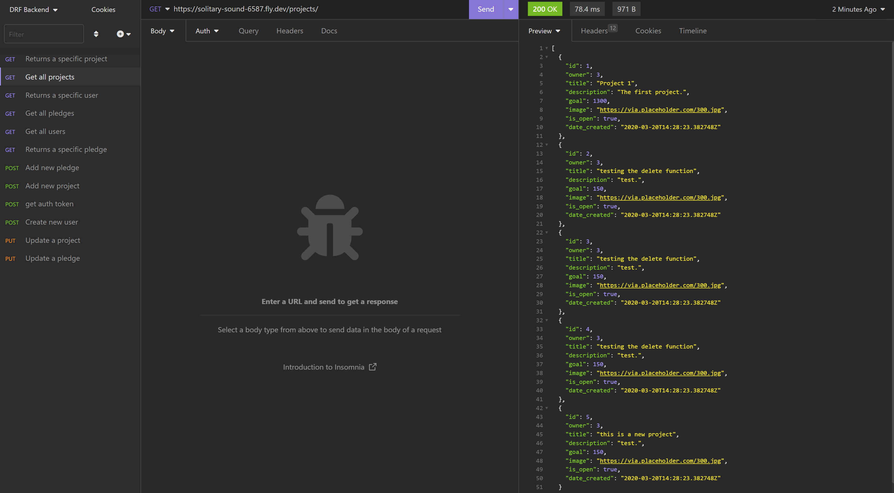
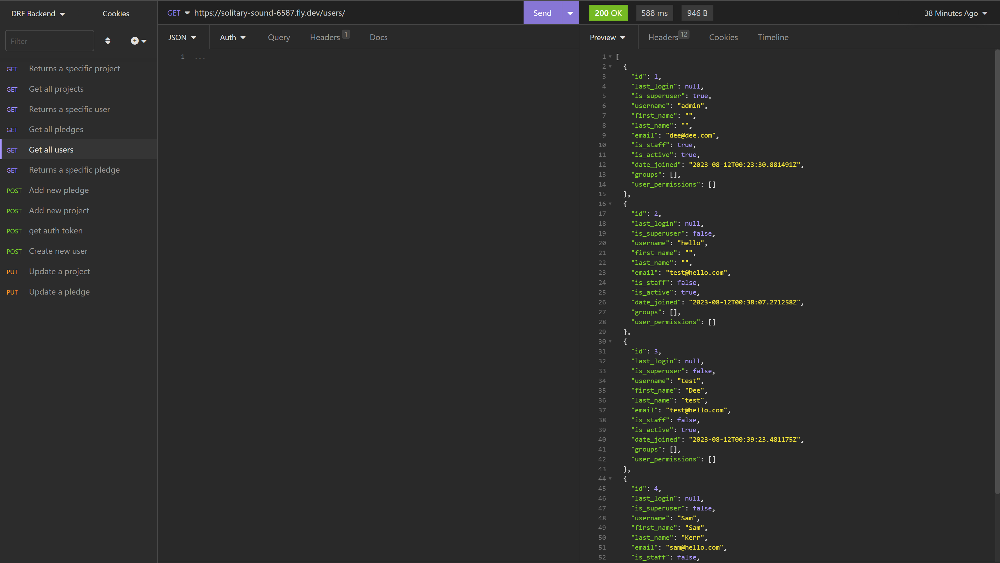
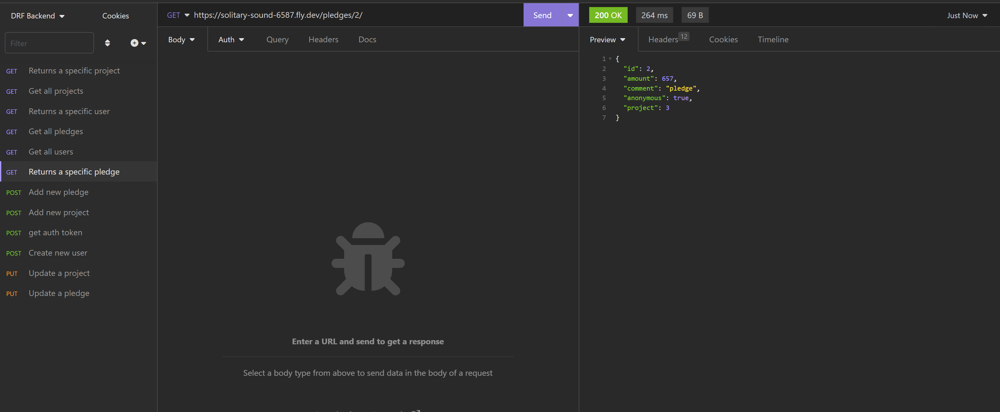
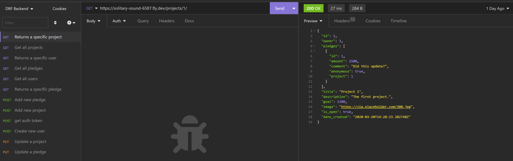
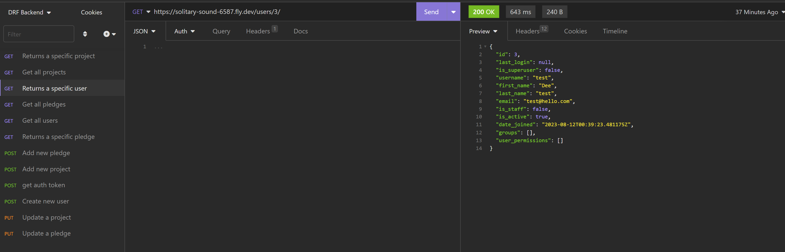

* A screenshot of Insomnia, demonstrating a successful POST method for any endpoint.
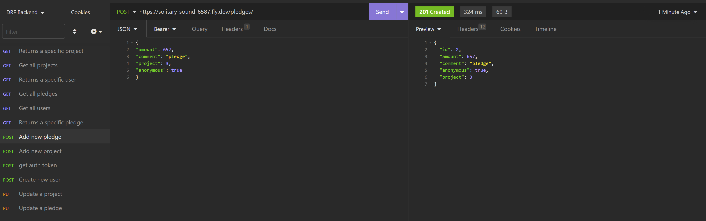
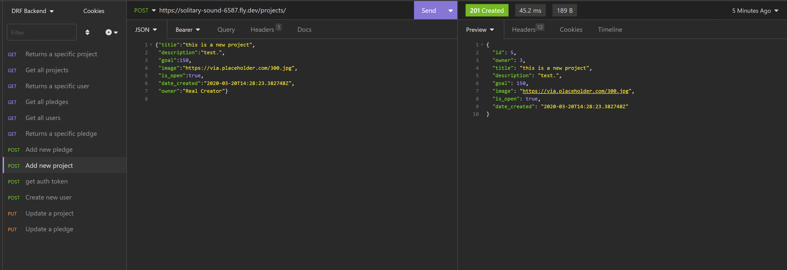
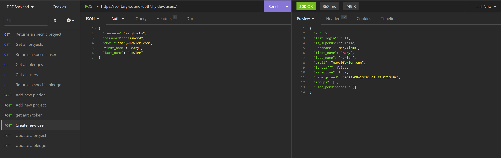

* A screenshot of Insomnia, demonstrating a token being returned.
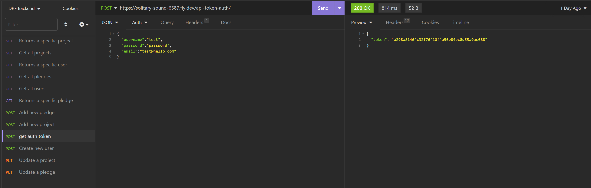